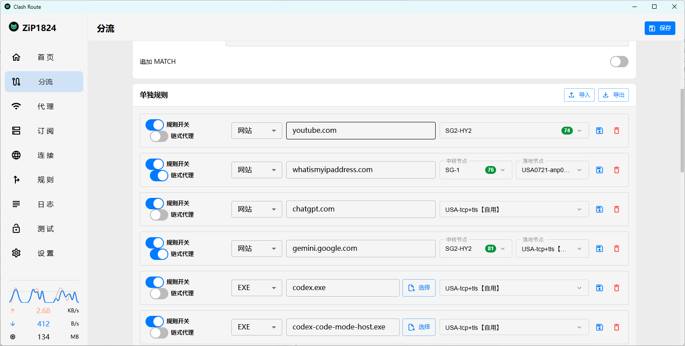
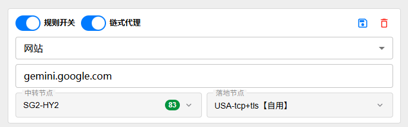
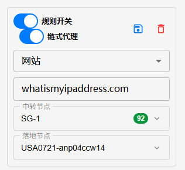
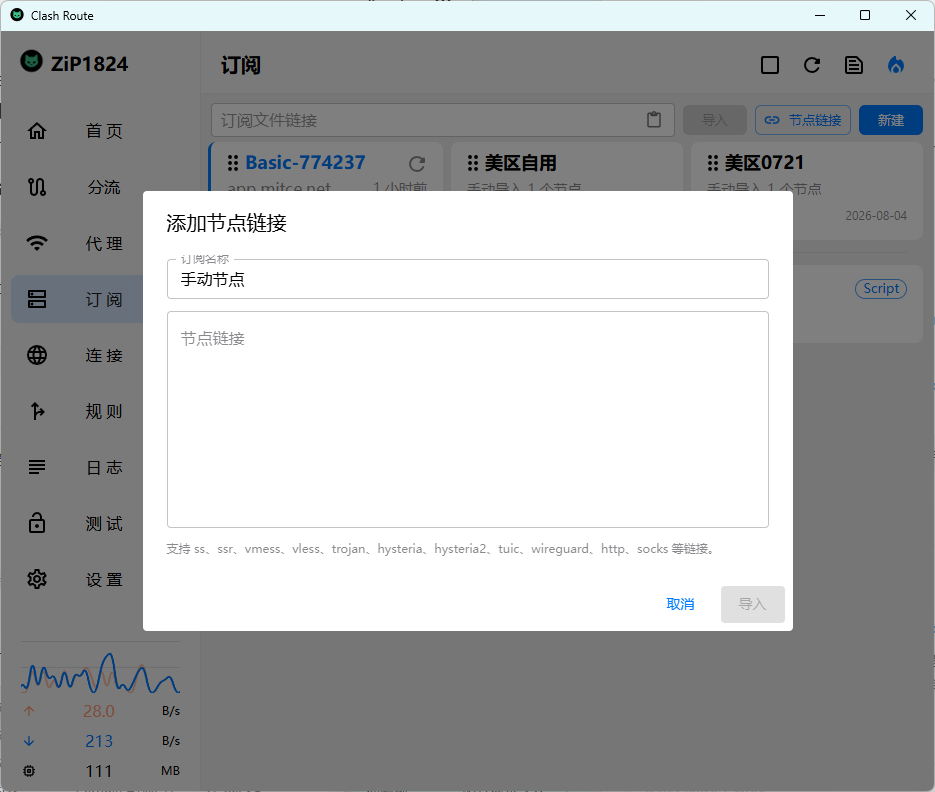

<h1 align="center">
  
  <br>
  Clash Route
  <br>
</h1>

<h3 align="center">
  一个围绕“分流规则”和“节点管理”重新整理体验的 Clash Meta 桌面客户端。
</h3>

<p align="center">
  基于 <a href="https://github.com/tauri-apps/tauri">Tauri</a>、Rust 与 <a href="https://github.com/MetaCubeX/mihomo">mihomo</a> 构建，保留 Clash Verge Rev 的核心能力，并强化常用分流场景。
</p>

## 预览

| 分流总览 | 单条规则 |
| --- | --- |
|  |  |

| 订阅新增手动加入节点 | 添加节点 |
| --- | --- |
|  |  |

## 核心定位

Clash Route 更适合需要精细控制流量走向的用户：你可以把网站、应用程序、AI 服务、流媒体、国内外规则拆开管理，也可以为单条规则指定普通落地节点或链式代理节点。

它不是只给你一个“全局代理”开关，而是让你清楚知道：

- 哪个网站走哪个节点
- 哪个 EXE 程序走哪个节点
- 哪条规则启用了链式代理
- 哪个节点是中转节点，哪个节点是落地节点
- 保存某一条规则时只重连这条规则影响到的连接

## 分流功能

### 分流优先级说明

开启“分流”总开关后，Clash Route 会以分流页面生成的策略为准。此时：

- 原“代理”板块里选择的代理组 / 当前节点不再作为全局出口生效
- 首页显示的“当前节点”也不再代表实际所有流量的出口
- 每一条流量会按照分流规则、默认策略和最终策略分别选择对应节点

简单理解：分流开启后，流量不再只看一个“当前节点”，而是按规则分别走不同节点。需要统一切换全局节点时，请先关闭分流总开关，再回到代理板块选择节点。

### 单独规则

在“分流”页面可以为每一条规则单独设置：

- 规则开关：快速启用或停用当前规则
- 链式代理：开启后可分别选择中转节点和落地节点
- 类型选择：支持网站域名和 EXE 程序
- 规则内容：填写域名、进程名或可执行文件路径
- 落地节点：不开链式代理时，当前规则直接使用该节点
- 中转节点 / 落地节点：开启链式代理后，流量按链式路径转发

每条规则都拥有独立的保存按钮和删除按钮。点击单条保存时，只应用当前规则，并只断开这条规则匹配到的连接；点击页面右上角的大保存时，则应用整套分流配置并重连全部连接。

### 链式代理

链式代理用于需要“先经过一个节点，再从另一个节点出口”的场景。Clash Route 在节点框边框上直接标明：

- 中转节点：流量先经过的节点
- 落地节点：最终访问目标网站或服务的出口节点

即使没有开启链式代理，普通节点选择框也会显示“落地节点”，方便第一次使用的人理解当前规则最终从哪里出去。

### 网站与 EXE 分流

网站规则适合处理常见域名，例如：

- `youtube.com`
- `chatgpt.com`
- `gemini.google.com`

EXE 规则适合处理本地程序，例如：

- `codex.exe`
- `steam.exe`
- `chrome.exe`

选择 EXE 类型后，可以直接通过“选择”按钮定位程序路径，按钮会紧跟在路径输入框右侧，减少来回查找路径的麻烦。

## 节点导入与选择

Clash Route 支持从订阅中导入节点，并在分流规则里选择所有分组下的可用节点。你不需要先切到某个订阅分组再回来配置分流，分流节点选择器会聚合：

- 当前配置中的策略组
- 订阅导入的节点
- 其他分组下的节点
- 手动配置或增强配置中的节点

节点选择器支持按分组筛选、搜索、排序和延迟测试。跨分组选择节点后，延迟测试会先把被测试节点加入运行配置，再进行测试，避免出现“其他分组节点全部 Timeout”的情况。

## 规则导入与导出

单独规则支持 JSON 导入和导出，适合在多台设备之间迁移分流规则，或者把常用规则整理成自己的模板。

导入时会按规则类型和规则内容去重，已经存在的规则会被更新，新规则会被追加。导出时只导出有效的单独规则，方便备份和分享。

## 安装

前往 [Release 页面](https://github.com/ZiP1824/Clash-Route/releases) 下载适合系统的安装包。

当前项目主要面向 Windows 桌面使用场景，后续可根据构建配置继续扩展其他平台。

## 功能特性

- 基于 Rust、Tauri 2 与 mihomo 内核构建
- 分流页面支持总开关、默认策略、单独规则、规则模块和实时连接监控
- 单独规则支持网站域名和 EXE 程序
- 支持普通落地节点和链式代理节点
- 节点选择器支持跨订阅、跨分组选择节点
- 支持跨分组节点延迟测试
- 支持单条规则保存，只重连当前规则影响到的连接
- 支持整套分流配置保存并全量重连
- 支持单独规则导入和导出
- 支持订阅节点导入、代理组选择、规则管理、日志查看、连接查看和基础设置

## 开发

安装 Tauri 相关依赖后，可以使用以下命令启动开发环境：

```shell
pnpm i
pnpm run prebuild
pnpm dev
```

构建正式安装包：

```shell
pnpm run build
```

## 贡献

欢迎提交 Issue 和 Pull Request。  
如果你在分流、节点导入、链式代理或延迟测试中遇到问题，可以在 Issue 中附上规则截图、节点分组截图和复现步骤。

## 致谢

Clash Route 基于或参考了以下项目：

- [clash-verge-rev/clash-verge-rev](https://github.com/clash-verge-rev/clash-verge-rev)：Clash Verge Rev 主项目
- [zzzgydi/clash-verge](https://github.com/zzzgydi/clash-verge)：基于 Tauri 的 Clash GUI
- [tauri-apps/tauri](https://github.com/tauri-apps/tauri)：桌面应用框架
- [MetaCubeX/mihomo](https://github.com/MetaCubeX/mihomo)：Clash Meta 内核
- [Dreamacro/clash](https://github.com/Dreamacro/clash)：规则代理内核项目
- [vitejs/vite](https://github.com/vitejs/vite)：前端构建工具

## 许可证

本项目遵循 GPL-3.0 License，详情见 [LICENSE](./LICENSE)。
